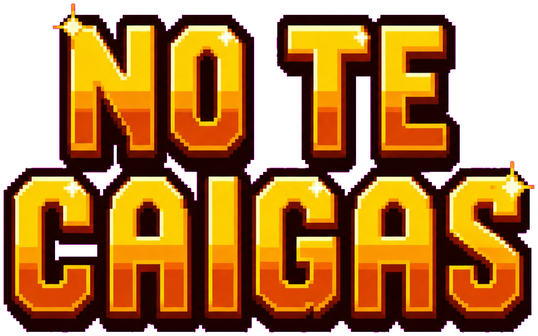

<div align="center">



### A score-chasing mine-cart runner. Pixel-art tribute to the SNES classic.

[

[](https://developer.mozilla.org/en-US/docs/Web/HTML/Element/canvas)
[](#)
[](#)
[](Dockerfile)
[](#)
[](https://claude.com/claude-code)
[](LICENSE)

</div>

---

## What is it?

A browser-playable, mobile-friendly runner inspired by the iconic
**Mine Cart Carnage** level from *Donkey Kong Country* (SNES, 1994).
Hold the screen to jump. Collect bananas, build combos, and reach 1,000 points
to complete the level. Don't fall.

The frontend remains a single `index.html` with zero build step. A small Node.js
server adds persistent realtime rankings. Mobile-first but feels great on desktop too.

## Features

- 🎢 **Procedural mine-cart track** with 6 segment types: flat, slopes,
  gaps, stacked twin rails, valleys, oncoming carts
- 🍌 **Bananas + mega-bananas** with fly-to-counter pickup animation
- 🎯 **Combo system**: score multiplier that grows with banana streaks,
  with milestone celebrations at every x10
- 🦘 **Analog jump**: hold longer = jump higher (variable gravity)
- 🐊 **Kremling-style enemies** that ride toward you on parallel rails
- 💥 **TNT barrel explosions** with hand-painted boom sprite
- 🎵 **Synthesized chiptune** soundtrack (Web Audio, no samples) that
  layers in extra parts as your combo climbs
- 📱 **Real portrait mode**: the canvas resizes and the layout adapts,
  not just letterboxed landscape
- 🎨 **AI-generated 16-bit pixel art** sprites with proper alpha-keyed
  PNGs (Vision framework + magenta chroma-key pipeline)
- 📺 **CRT scanline overlay** for retro CRT vibes
- 👤 **Player names** stored locally and editable from the menu
- 🏆 **Realtime leaderboard** broadcast to every connected player over WebSockets
- 💾 **Persistent scores** in a Docker volume (plus localStorage personal bests)

## Controls

| Action | Desktop | Mobile |
|---|---|---|
| Jump | `Space` / `↑` / `W` | Tap and hold the screen |
| Higher jump | Hold the key longer | Hold the screen longer |
| Toggle music | `M` | n/a |

## Tech

- **HTML5 Canvas** for everything
- **Vanilla JavaScript**, no framework, no build step
- **Web Audio API** for synthesized chiptune music + SFX
- **localStorage** for player profile and personal high-score persistence
- **Node.js + WebSockets** for static hosting and the realtime leaderboard
- **Sprite pipeline** (in [`scripts/`](scripts/)):
  - Sprites generated with Google's Nano Banana (Gemini 2.5 Flash Image)
  - Backgrounds removed with macOS Vision framework via a small Swift script
  - Magenta chroma-key fallback for assets where Vision over-keys (logo)
  - Python helpers to harden alpha, fill interior holes, and erase wheel
    wells so we can overlay rotating wheel sprites

## Local development

```bash
npm install
npm start
# → http://localhost:8080
```

The game still has no frontend build step. Run it through the Node server to enable names, score persistence, and live leaderboard updates.

## Docker deployment

```bash
docker compose up --build -d
# → http://localhost:8080
```

`compose.yaml` mounts a named volume at `/data`, so leaderboard scores survive container replacement. Set `PORT` and `LEADERBOARD_FILE` to customize the server. The container exposes `/healthz` for health checks.

See [`TODO.md`](TODO.md) for the security, anti-cheat, identity, database, and multi-replica work recommended before a public competitive deployment.

## Project structure

```
mine-cart-carnage/
├── index.html           # game and player/leaderboard UI
├── server.js            # static server + WebSocket leaderboard
├── Dockerfile
├── compose.yaml
├── TODO.md              # production leaderboard follow-ups
├── assets/              # sprites, logo, cave background
└── scripts/             # one-shot pipeline tools (Node, Python, Swift)
```

## Credits & disclaimer

Inspired by *Donkey Kong Country* (Rare / Nintendo, 1994). All sprites and
audio in this project are original (generated or synthesized) and the
character design intentionally avoids reproducing Nintendo's IP. This is a
fan-made tribute, not affiliated with or endorsed by Rare or Nintendo.

Built collaboratively with [Claude Code](https://claude.com/claude-code).

## License

MIT. See [LICENSE](LICENSE).
